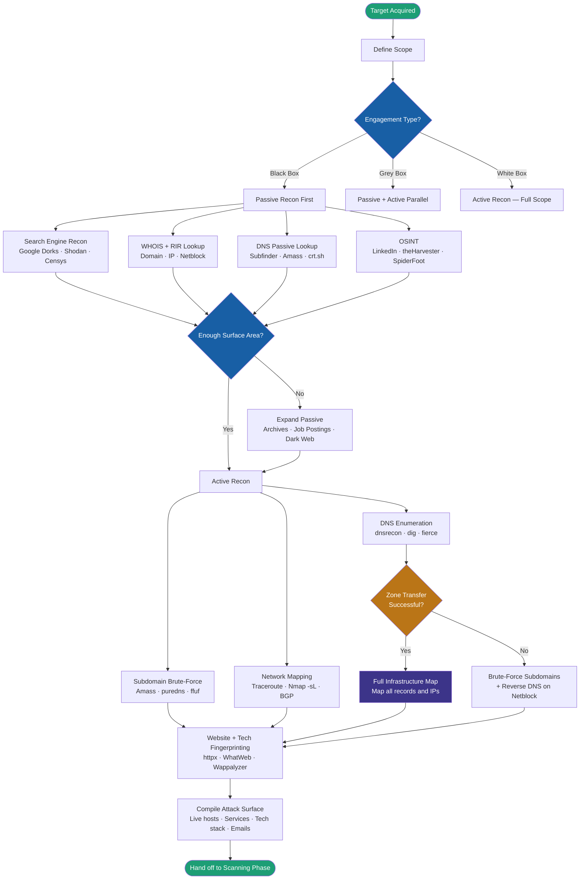

# Footprinting & Reconnaissance — Field Reference

> A practical methodology guide for CEH candidates, OSCP students, and penetration testers. Built for real assessments, not just exams.

---

## Who This Is For

- **CEH candidates** — covers every topic in **Footprinting & Reconnaissance** with exam-focused explanations
- **OSCP students** — methodology-first approach that matches how real engagements run
- **Bug bounty hunters** — tool chains and passive recon techniques for external attack surface mapping
- **Pentesters** — quick reference during active engagements; skip the theory, get the commands

---

## How to Use This Repository

If you are **studying for CEH** — read each section in order. The theory explanations map directly to exam objectives.

If you are **on an engagement** — jump straight to the [Methodology Flowchart](#methodology-flowchart) and follow the decision tree. Each step links to the relevant command reference.

If you want **specific tool commands** — go to [Tool Reference](docs/tool-reference.md) or the [Cheat Sheet](cheatsheets/recon-cheatsheet.md).

---

## Repository Structure

```
recon-methodology/
├── README.md                        ← You are here — start here
├── docs/
│   ├── 01-methodology.md            ← Recon workflow and decision logic
│   ├── 02-passive-recon.md          ← Passive techniques — zero contact
│   ├── 03-active-recon.md           ← Active techniques — direct interaction
│   ├── 04-dns-enumeration.md        ← DNS deep dive — records, zone transfers, tools
│   ├── 05-whois-ip-intel.md         ← WHOIS, RIRs, netblock discovery
│   ├── 06-search-engine-recon.md    ← Google dorking, Shodan, Censys
│   ├── 07-email-enumeration.md      ← Email harvesting, header analysis, SMTP
│   ├── 08-subdomain-enumeration.md  ← Passive + active subdomain discovery
│   ├── 09-network-footprinting.md   ← Traceroute, BGP, ASN, network mapping
│   ├── 10-website-enumeration.md    ← Tech fingerprinting, crawling, archives
│   ├── 11-osint-social-media.md     ← LinkedIn, people search, dark web
│   └── tool-reference.md            ← Every tool — what it does, when to use it
├── cheatsheets/
│   ├── recon-cheatsheet.md          ← One-page quick reference
│   ├── dns-records-cheatsheet.md    ← All DNS record types and recon value
│   └── google-dorks-cheatsheet.md   ← Dork operators and ready-made queries
└── diagrams/
    └── methodology-flowchart.md     ← Mermaid decision tree
```

---

## Methodology Flowchart

The recon process is not linear — what you find determines what you do next. This flowchart reflects how it actually works.



---

## Quick Start — First 15 Minutes on a New Target

You just got a domain name. Here is the fastest path to a full picture.

```bash
# 1. Resolve the IP and check the netblock (30 seconds)
dig target.com A +short
whois $(dig target.com A +short | head -1) | grep -E "NetRange|CIDR|OrgName"

# 2. Pull all DNS records (1 minute)
dig target.com ANY +noall +answer
dnsrecon -d target.com -t std

# 3. Attempt zone transfer — if it works, you are done with DNS (30 seconds)
dnsrecon -d target.com -t axfr

# 4. Passive subdomain discovery (2-3 minutes, runs in background)
subfinder -d target.com -silent -o subs.txt &
curl -s "https://crt.sh/?q=%.target.com&output=json" | jq -r '.[].name_value' | sort -u >> subs.txt

# 5. Harvest emails and exposed info (1 minute)
theHarvester -d target.com -l 200 -b google,linkedin

# 6. Resolve live subdomains and probe HTTP (2-3 minutes)
sort -u subs.txt | dnsx -a -resp -silent | tee live-dns.txt
cat live-dns.txt | awk '{print $1}' | httpx -title -sc -tech-detect -silent

# 7. Reverse map the netblock (background, 2-3 minutes)
dnsrecon -r $(whois target-ip | grep NetRange | awk '{print $2"-"$4}')
```

By the time these finish you will have: confirmed IPs, full DNS record set, all reachable subdomains, email addresses, technology stack, and a labeled map of the target's IP range.

---

## Techniques at a Glance

| Technique | Type | Primary Tool | What You Get |
|---|---|---|---|
| WHOIS Lookup | Passive | `whois` | Registrant, name servers, netblock, dates |
| DNS Record Enum | Active | `dnsrecon`, `dig` | All record types, mail servers, internal IPs |
| Zone Transfer | Active | `dig axfr`, `dnsrecon` | Complete subdomain and IP dump |
| Google Dorking | Passive | Browser + GHDB | Exposed files, login portals, config files |
| Shodan Search | Passive | `shodan` CLI / web | Open ports, banners, device fingerprints |
| Email Harvesting | Passive | `theHarvester` | Email addresses, employee names |
| Subdomain Enum | Both | `subfinder`, `amass` | Full subdomain attack surface |
| Reverse DNS | Active | `dnsrecon -r`, `dnsx` | Hostnames from IP ranges |
| Traceroute | Active | `traceroute`, `tcptraceroute` | Network path, routers, firewalls |
| Tech Fingerprint | Active | `httpx`, `WhatWeb` | CMS, frameworks, server versions |
| Cert Transparency | Passive | `crt.sh`, `Findomain` | Subdomains from SSL certificates |
| OSINT / Social | Passive | `SpiderFoot`, `Maltego` | Org structure, employees, vendors |

---

## OPSEC Notes

> These apply when stealth matters — red team engagements, assessments where detection is in scope, or bug bounty programs with strict ToS.

- **Passive first, always.** Active recon generates logs on every system you touch. Passive leaves nothing on the target.
- **Use a dedicated recon VPS** — never run active recon from your home IP or a client network. Spin up a DigitalOcean or Linode droplet, recon from there, then destroy it.
- **Rotate DNS resolvers** during brute-force — hammering a single resolver from one IP will trigger rate limits and potentially alert the target's DNS provider.
- **Respect TTLs** — querying the same record repeatedly in a short window can appear anomalous in DNS logs.
- **Google dorks are fully passive** — Google has already crawled the content. Your query touches Google's servers, not the target's.
- **Shodan and Censys queries are passive** — they query a pre-built index, not the live target.
- **theHarvester `-b` source matters** — `google` and `bing` sources are passive. `baidu` and `hunter` make direct API calls that may log your query.

---

## CEH Exam Quick Reference

Key facts the CEH exam tests directly from this module:

| Topic | Key Facts |
|---|---|
| Passive vs Active | Passive = no direct contact, no target logs. Active = direct interaction, leaves traces |
| Footprinting info categories | 3 types — Organizational, Network, System |
| Footprinting threats | 6 — Social engineering, System attacks, Info leakage, Privacy loss, Corporate espionage, Business loss |
| Whois port | TCP port 43 |
| Whois models | Thick (complete data in one place), Thin (pointer to registrar), Decentralized |
| RIRs | ARIN (N.America), APNIC (Asia-Pacific), RIPE (Europe/ME), AFRINIC (Africa), LACNIC (Latin America) |
| Zone transfer request type | AXFR (full), IXFR (incremental) |
| Traceroute — Windows | `tracert` — uses ICMP by default |
| Traceroute — Linux | `traceroute` — uses UDP by default |
| TCP traceroute purpose | Bypasses firewalls that block ICMP |
| Google dork — file type | `filetype:pdf site:target.com` |
| Google dork — title | `intitle:"index of"` |
| GHDB location | exploit-db.com/google-hacking-database |

---

## Contributing

If you spot an error, a missing tool, or a better command — open a PR. This is meant to be a living document.

---

## References

- [CEH v13 Official Courseware — EC-Council](https://www.eccouncil.org)
- [OWASP Testing Guide — Information Gathering](https://owasp.org/www-project-web-security-testing-guide/)
- [ProjectDiscovery Tool Suite](https://projectdiscovery.io)
- [Google Hacking Database — Exploit-DB](https://www.exploit-db.com/google-hacking-database)
- [SecLists — DNS Wordlists](https://github.com/danielmiessler/SecLists/tree/master/Discovery/DNS)
- [ARIN RDAP](https://search.arin.net)
- [Certificate Transparency — crt.sh](https://crt.sh)

---

*Built for the security community. Use responsibly and only on systems you have permission to test.*
